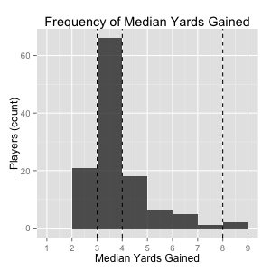

# median_rush
Analysis on the median rush distance of NFL players and teams during the 2014 regular season.

## Questions under analysis
Which NFL players are the best rushers, as measured by median yards gained?

Typically, the effectiveness of ball carriers is measured using average yards per carry. Like all means, it can be skewed by a single outlier, typically a long run. A player can have a generally poor performance, having multiple carries of three or less yards, but have a high average due to a big play caused by a missed tackle. It was previously proposed by the Grantland NFL Podcast that the median rush distance would be a better statistic for comparing rusher effectiveness. While not difficult, finding the median can be relatively compared to finding the average, however, this is alleviated by using a software package like R.

## Data included in analysis
This analysis is performed using play-by-play data from the 2014 NFL regular season. The data was obtained from NFLSavant.com.

### Plays selected
The analysis was performed on plays classified as "RUSH" and "SCRAMBLE" in the original data that were not "NO PLAY". Scrambles are included in the analysis because scrambles contribute to the traditional rushing box score and defenses prepare for this possibility in their schemes. "NO PLAY" means there was an accepted penalty that nullified the play. 

## Script Function
The primary script is median_rush.R. When run, it sources the other necessary scripts to produce a data frame of players and their rushing statistics.

### acquire_data.R
This script downloads the 2014 play-by-play data from NFLSavant.com and reads it into a data table called allPlays.

### create_tidy.R
The original data frame is first converted into a dplyr data frame. The rush plays, as described above, are filtered into a new data frame called rushPlays.

The next steps of cleaning are to convert the GameDate column from a factor into a date, then convert the Yards column from an integer into a numeric. These are necessary for the cleaning and analysis steps that come later.

The script then sources two functions date2nflweek and playername. data2nflweek takes a date during the 2014 NFL season and determines which week of the NFL it occurred. playername takes the play description and extracts the name of the rusher. In most cases, the rusher is named first in the description. The special case is when a player declares eligible; when this occurs, the rushing player is named second.

The final step in the script is to create a tidy data set called tidyRush. Each row contains the week, player name, yards gained, offensive team, and defensive team. 

### Final steps in median_rush.R
After the creation of tidyRush, the final data set, medianRush, is created. Using dplyr, tidyRush is grouped by player then the following statistics are determined:
*Median rush distance (Median)
*Mean rush distance (Mean)
*Total number of carries (Carries)
*Total yards gained (TotalYards)
The data frame is then filtered to only include rushers with at least 20 carries and  sorted from highest median to lowest. Last, medianRush is written to a csv file and png is made of histogram of the median yards gained.

## Results

119 player rushed atleast 20 carries. The figure above plots the count of players for median yards gained. The vertical dashed lines mark the quantiles.

The players in the top twp quantiles are:
Rank | Player | Median | Mean | Carries | TotalYards
-----|--------|--------|------|---------|-----------
1 | A.RODGERS | 8 | 9 | | 278
2 | J.CUTLER | 8 | 8.9 | 22 | 196
3 | R.WILSON | 7 | 9.1 | 94 | 858
4 | B.BORTLES | 6 | 8.3 | 51 | 421
5 | M.RYAN | 6 | 6.2 | 24 | 149
6 | M.VICK | 6 | 7.1 | 22 | 156
7 | P.HARVIN | 6 | 6.8 | 31 | 212
8 | R.TANNEHILL | 6 | 8.5 | 39 | 331
9 | A.LUCK | 5 | 6.1 | 45 | 273
10 | C.KAEPERNICK | 5 | 7.7 | 86 | 658
11 | C.NEWTON | 5 | 5.7 | 93 | 529
12 | R.FITZPATRICK | 5 | 5.4 | 37 | 200
13 | R.GRIFFIN | 5 | 5.6 | 34 | 191
14 | T.AUSTIN | 5 | 6.2 | 36 | 224
15 | A.BRADSHAW | 4 | 4.6 | 87 | 398
16 | A.SMITH | 4 | 6.4 | 63 | 402
17 | B.POWELL | 4 | 4.2 | 30 | 125
18 | D.HERRON | 4 | 4.5 | 78 | 351
19 | D.SPROLES | 4 | 5.9 | 56 | 329
20 | J.GRAY | 4 | 4.6 | 90 | 410
21 | J.GRIMES | 4 | 3.9 | 34 | 131
22 | J.MCCOWN | 4 | 5.8 | 21 | 122
23 | K.CAREY | 4 | 4.4 | 36 | 158
24 | K.MORENO | 4 | 4.8 | 31 | 148
25 | K.WILLIAMS | 4 | 4.6 | 53 | 245
26 | M.STAFFORD | 4 | 5 | 22 | 111
27 | P.HILLIS | 4 | 4.5 | 26 | 116
28 | P.RIVERS | 4 | 4.7 | 24 | 113
29 | P.THOMAS | 4 | 5.2 | 45 | 232
30 | R.HELU | 4 | 5.4 | 40 | 216
31 | R.TURBIN | 4 | 4.1 | 74 | 305
32 | T.BRIDGEWATER | 4 | 5.5 | 40 | 218

## Discussion
Nine of the top 10 are quarterbacks, with the exception being Percy Harvin at 7. The first traditional running back is Bradshaw. When designing this analysis, I decided to include quarterback scrambles, because their rushing yards are included in the total, and defenses have to scheme for mobile quarterbacks. I was surprised to see the top of the list dominated by quarterbacks. While Wilson, Vick, and Kaepernick are known as running quarterbacks, and Rodger's mobility is often mentioned, quarterbacks such as Culter and Bortles are not known for their running. The success of quarterbacks makes intuitive sense since quarterbacks scramble when they have the advantage, such as open space.

These results support the argument that running backs have relatively low value compared to other offensive positions. The difference between a good running back and an average one is one yard, but even that distinction is difficult to make. No top running back has 100 carries, and many are back-ups or change-of-pace backs. A reasonable conclusion based on these results is that most NFL running backs are about the same.

Median yards gained does not provide a useful way to evaluate individual running backs. It does provide an overall picture of rushing in the NFL, one with a large middle and little upside any individual.